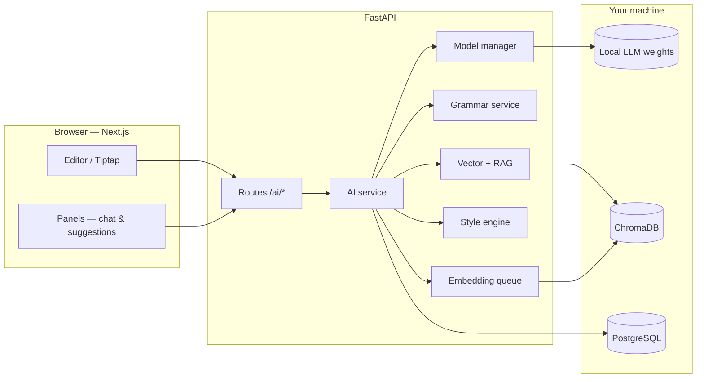

<div align="center">

# AI Doc Editor

### *A local-first writing studio where your documents meet real intelligence.*

[](https://nextjs.org/)
[](https://www.typescriptlang.org/)
[](https://fastapi.tiangolo.com/)
[](https://www.python.org/)

**No OpenAI lock-in.** Run **LLaMA 3**, **Mistral**, or **Mixtral** from disk, enrich answers with **RAG**, tighten prose with a **dedicated grammar engine**, and let the system **learn your voice**—all wired through a polished **Tiptap** editor.

<br />

[Features](#-what-makes-it-special) · [Architecture](#-how-it-fits-together) · [Quick start](#-quick-start) · [Configuration](#-configuration) · [API](#-api) · [Training](#-fine-tuning--evaluation) · [License](#-license)

<br />

</div>

---

## The story

**AI Doc Editor** is built for people who want the *feel* of a modern doc tool and the *control* of a stack they own. You type in a rich editor; the backend analyzes structure, grammar, and style, retrieves relevant context from your own document chunks, and asks a **local** language model to suggest improvements, summaries, and chat-style edits—without shipping your draft to a third-party API.

The frontend is a **Next.js** app with **Tailwind** styling and **ProseMirror (Tiptap)** for serious editing: suggestions carry **exact character ranges**, show up **inline**, and apply through **real transactions** so the document tree stays valid.

The backend is **FastAPI**: fast iteration, automatic OpenAPI docs, streaming responses, and a **WebSocket** channel so the AI chat panel can update **token by token** while incremental suggestions land in the UI.

---

## What makes it special

| Capability | What you get |
|------------|----------------|
| **Local LLM** | Hugging Face **Transformers** loads weights from disk; **PEFT / LoRA** adapters optional. Templates tuned for **LLaMA 3** and **Mistral-family** (including **Mixtral**) chat formats. |
| **Model manager** | Switch active model via env or request hints; **semaphore-limited** generation so one machine doesn’t melt under load. |
| **RAG** | **ChromaDB** stores chunk embeddings; retrieval runs **before** LLM prompts so answers stay grounded in *this* document. |
| **Grammar engine** | **Separate from the LLM**: rules, spellcheck (**pyspellchecker**), readability (**textstat**), optional **LanguageTool**—structured issues with spans and suggestions. |
| **Style engine** | Profiles sentence length, vocabulary, tone, and structure; **style constraints** prepended to prompts so the model tracks *your* voice. |
| **Editor UX** | Range-based suggestions, highlights, accept/reject; WebSocket streaming for live chat. |
| **Scale-minded** | Analysis/LLM caching patterns, **async embedding indexer** with **batched** embedding work for many documents. |
| **Training & eval** | Instruction JSONL pipeline, **LoRA** training, validation scripts, and **benchmark** runners with ROUGE-style and latency metrics. |

---

## How it fits together



---

## Tech stack

| Layer | Choices |
|-------|---------|
| **UI** | Next.js 15, React 19, TypeScript, Tailwind CSS |
| **Editor** | Tiptap / ProseMirror (tables, code blocks, links) |
| **API** | FastAPI, Uvicorn, Pydantic |
| **AI / ML** | PyTorch, Transformers, PEFT, sentence-transformers |
| **Vectors** | ChromaDB (persistent index; SQLite-backed bookkeeping where configured) |
| **Data** | SQLAlchemy, PostgreSQL driver (`psycopg`) |

---

## Quick start

### Prerequisites

- **Node.js** 18+ (for the frontend)
- **Python** 3.10+ with `pip`
- Optional: **CUDA**-capable GPU for faster local inference
- Optional: **PostgreSQL** if you use the full persistence path

### Frontend

```bash
cd frontend
npm install
npm run dev
```

Open **[http://localhost:3000](http://localhost:3000)** — the home route redirects to the dashboard; use **`/editor`** for the full writing experience.

### Backend

```bash
cd backend
python -m venv .venv

# Windows
.\.venv\Scripts\activate
# macOS / Linux
# source .venv/bin/activate

pip install -r requirements.txt
uvicorn main:app --reload --port 8000
```

- API: **[http://127.0.0.1:8000](http://127.0.0.1:8000)**
- Interactive docs: **[http://127.0.0.1:8000/docs](http://127.0.0.1:8000/docs)**  
  *(The root URL `/` is API-only and may 404—that’s normal.)*

### Wire the frontend to the API

```bash
# frontend/.env.local (example)
NEXT_PUBLIC_API_BASE_URL=http://localhost:8000
```

---

## Configuration

### Local LLM (Transformers)

Point the backend at a directory with Hugging Face–format weights (`config.json`, tokenizer, safetensors or shard files). The family string selects chat-template fallbacks when the tokenizer has no `chat_template`.

```bash
# Primary: path to local weights (recommended)
LOCAL_LLM_MODEL_PATH=/path/to/Meta-Llama-3-8B-Instruct

# Or legacy alias / Hub id for development (downloads on first run)
# LOCAL_LLM_BASE_MODEL=mistralai/Mistral-7B-Instruct-v0.2

# llama3 | mistral | auto (auto: infer from config.json / path name)
LOCAL_LLM_MODEL_FAMILY=auto

# Optional LoRA (use the training run's final_adapter directory)
LOCAL_LLM_ADAPTER_PATH=backend/ai/models/checkpoints/v_<timestamp>_editor-lora/final_adapter
```

**Multi-model** (optional): set `LOCAL_LLM_ACTIVE_MODEL` to `mistral`, `llama`, or `mixtral`, and optionally override paths per family:

- `LOCAL_LLM_MISTRAL_MODEL_PATH`, `LOCAL_LLM_MISTRAL_ADAPTER_PATH`
- `LOCAL_LLM_LLAMA_MODEL_PATH`, `LOCAL_LLM_LLAMA_ADAPTER_PATH`
- `LOCAL_LLM_MIXTRAL_MODEL_PATH`, `LOCAL_LLM_MIXTRAL_ADAPTER_PATH`

If those are unset, the backend falls back to `LOCAL_LLM_MODEL_PATH` / `LOCAL_LLM_ADAPTER_PATH`.

```bash
LOCAL_LLM_MAX_NEW_TOKENS=256
LOCAL_LLM_TEMPERATURE=0.3
LOCAL_LLM_TOP_P=0.9

# Limit concurrent local generations (GPU/CPU safety)
LOCAL_LLM_MAX_CONCURRENT_GENERATIONS=1
```

### Richer grammar (optional)

```bash
pip install language-tool-python
```

LanguageTool may download components on first use; if it fails, the API still uses rules + spellcheck.

### RAG (ChromaDB)

| Variable | Role |
|----------|------|
| `CHROMA_PERSIST_DIR` | Vector store location (default: under `backend/` e.g. `chroma_data`) |
| `VECTOR_CHUNK_CHARS`, `VECTOR_CHUNK_OVERLAP`, `VECTOR_TOP_K` | Chunking and retrieval tuning |

**Background indexing** (batching across documents):

| Variable | Typical purpose |
|----------|-----------------|
| `VECTOR_INDEX_BATCH_WINDOW_MS` | Default `250` — coalesce tasks in a short window |
| `VECTOR_INDEX_MAX_BATCH_TASKS` | Default `12` |
| `VECTOR_INDEX_MAX_BATCH_CHUNKS` | Default `600` |

---

## API

| Endpoint | Description |
|----------|-------------|
| `POST /ai/analyze` | Document analysis: suggestions, scores, summary, grammar issues, style profile |
| `POST /ai/chat` | JSON assistant `reply` + `suggestions` |
| `POST /ai/chat/stream` | SSE: streamed tokens, then `done` or `error` |
| `WebSocket /ai/chat/ws` | JSON messages: `token`, `suggestions`, `done` / `error` |

---

## Fine-tuning & evaluation

Full instruction-tuning docs: **`backend/ai/training/README.md`**.

**Prepare data** (schema: `task`, `input_text`, `instruction`, `output_text`, optional `metadata`):

```bash
python backend/ai/training/prepare_dataset.py \
  --output-dir backend/ai/datasets/instruction \
  --sources grammar,summarize,rewrite,user_docs \
  --max-per-source 3000
```

Add `.txt` samples under `backend/ai/datasets/user_docs/` when using `user_docs`.

**Train** (versioned runs under `backend/ai/models/checkpoints/`):

```bash
python backend/ai/training/train_llm.py \
  --model-name mistralai/Mistral-7B-Instruct-v0.2 \
  --train-file backend/ai/datasets/instruction/train.jsonl \
  --val-file backend/ai/datasets/instruction/val.jsonl \
  --output-root backend/ai/models/checkpoints \
  --run-name editor-lora
```

**Evaluate** adapter + validation loss / perplexity:

```bash
python backend/ai/training/evaluate_model.py \
  --base-model mistralai/Mistral-7B-Instruct-v0.2 \
  --adapter-path backend/ai/models/checkpoints/v_<timestamp>_editor-lora/final_adapter \
  --val-file backend/ai/datasets/instruction/val.jsonl
```

**Benchmarks** (grammar / summarization / rewrite + latency): see `backend/ai/evaluation/`.

---

## License

This project’s **source code** is released under the **[MIT License](LICENSE)**.

### Third-party & model weights

- **Dependencies** (Next.js, FastAPI, PyTorch, Transformers, ChromaDB, Tiptap, etc.) are licensed under their respective **open-source terms**—see each package’s `LICENSE` in `node_modules` or your Python environment.
- **Base model weights** (e.g. LLaMA, Mistral, Mixtral) are **not** included in this repository and remain subject to their **original licenses** from Meta, Mistral AI, or other publishers. You are responsible for **compliance** when you download, fine-tune, or redistribute those weights.

---

<div align="center">

**Built for writers who want AI superpowers without giving up the keys.**

<br />

<sub>README crafted for clarity—tweak the tagline, add your screenshot, and ship.</sub>

</div>
